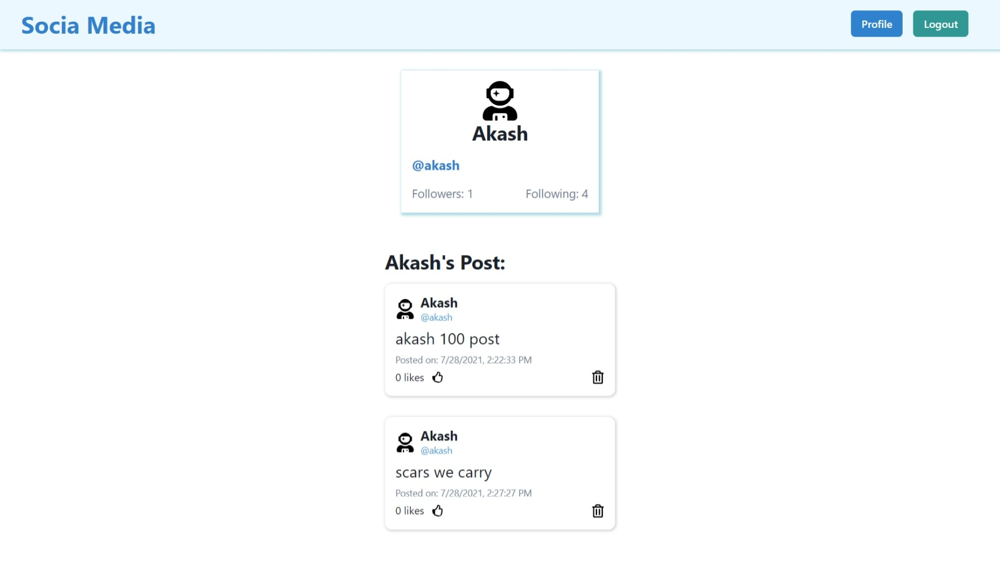

# Getting Started with Social Media App

This project was bootstrapped with [Create React App](https://github.com/facebook/create-react-app).

## Available Scripts

In the project directory, you can run:

### `npm start`

Runs the app in the development mode.\
Open [http://localhost:3000](http://localhost:3000) to view it in the browser.

The page will reload if you make edits.\
You will also see any lint errors in the console.

## Features

-   navigate between login and signup page
-   one can see error message
-   one can add new post
-   one can delete the post that he/she created
-   one can like the post
-   one can see the users to follow

## Screenshots

### Login

### SignUp

### Home

### Profile

